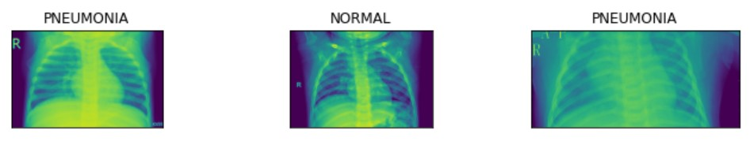
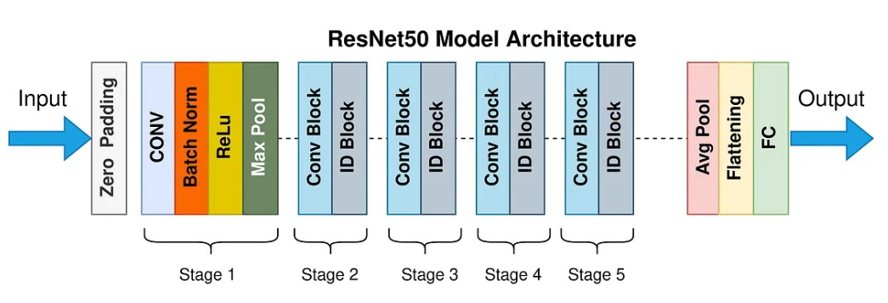
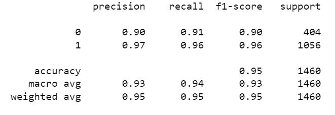
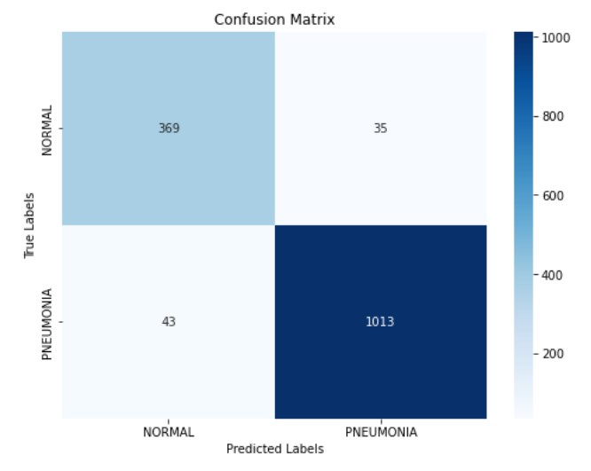

# Pneumonia Detection Using RestNet-50
Pneumonia Detection using ResNet-50 is repository contains all the files and scripts necessary for training and testing a deep learning model to detect pneumonia using chest X-ray images. This includes:

1. Dataset and preprocessing scripts.
2. Exploratory Data Analysis (EDA)
3. Modelling and Training scripts.
4. Evaluation metrics and visualization scripts.
5. Results and analysis section.

## Overview
(source: [Wikipedia](https://en.wikipedia.org/wiki/Pneumonia))

Pneumonia is an inflammatory condition of the lung primariy affecting the small air sacs known as alveoli in one or both lungs. It can be caused by infection with viruses or bacteria; and identifying the pathogen responsible for Pneumonia could be highly challenging.

Diagnosis of Pneumonia often starts with medical history and self reported symptoms, followed by a physical exam that usually includes chest auscultation. A chest radiograph would then be recommended if the doctors think the person might have Pneumonia. In adults with normal vital signs and a normal lung examination, the diagnosis is unlikely.

## Dataset
This project uses ResNet-50, a deep convolutional neural network, to classify chest X-ray images into normal or pneumonia-affected categories. It employs the Chest X-ray Images (Pneumonia) dataset from Kaggle, linked below:

**Dataset Link:** [Chest X-ray Pneumonia Dataset](https://www.kaggle.com/datasets/paultimothymooney/chest-xray-pneumonia)

### Dataset Structure
The dataset is divided into 2 directories:
- train
- test

Within each directory, there're 2 sub-directories: 
- NORMAL
- PNEUMONIA



and the labels for the images are the names of the corresponding directories they're located in.

```
chest_xray
    │
    ├── test
    │   ├── NORMAL
    │   │   └── image_01.jpeg
    │   └── PNEUMONIA
    │       └── image_02.jpeg
    └── train
        ├── NORMAL
        │   └── image_01.jpeg
        └── PNEUMONIA
            └── image_02.jpeg

```

### Overall Workflow

The workflow for this project follows these steps:

1. Data Loading and Preprocessing:

- Import the dataset.
- Normalize and augment images for better generalization.
2. Model Training:


3. Use ResNet-50 architecture with pre-trained ImageNet weights.
- Fine-tune the model on the pneumonia dataset.
4. Evaluation:

- Measure performance using metrics like accuracy, precision, recall, and F1 score.

5. Visualization:

- Generate and analyze confusion matrices and other evaluation plots.

